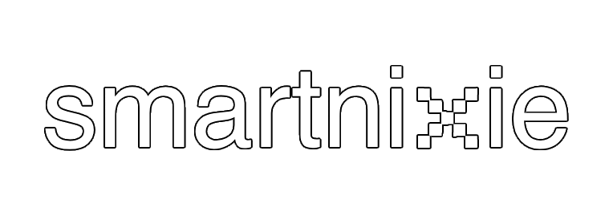
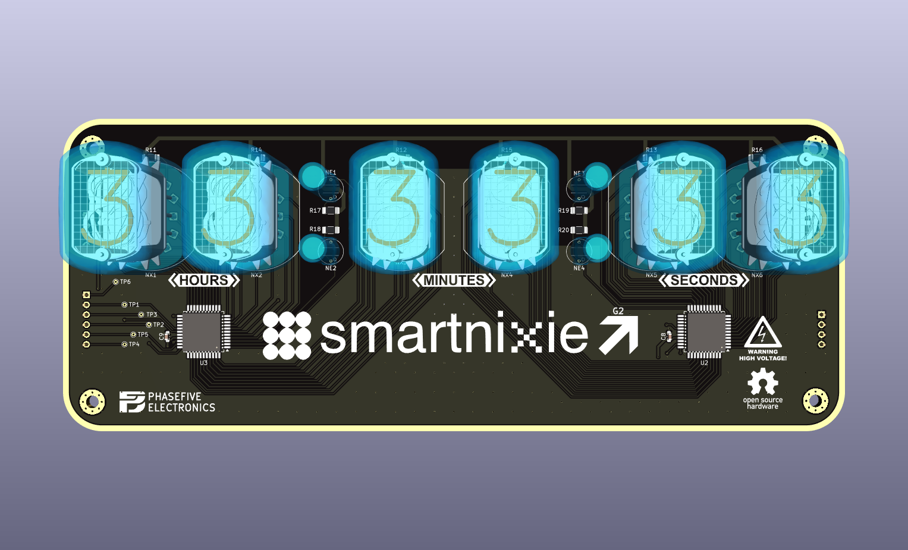

---

(Display Board PCB)

(Control Board PCB)

# About
This project is currently a work in progress. You can read up on this project's development process over on my personal blog [here](https://electron.observer/posts/smartnixie)!